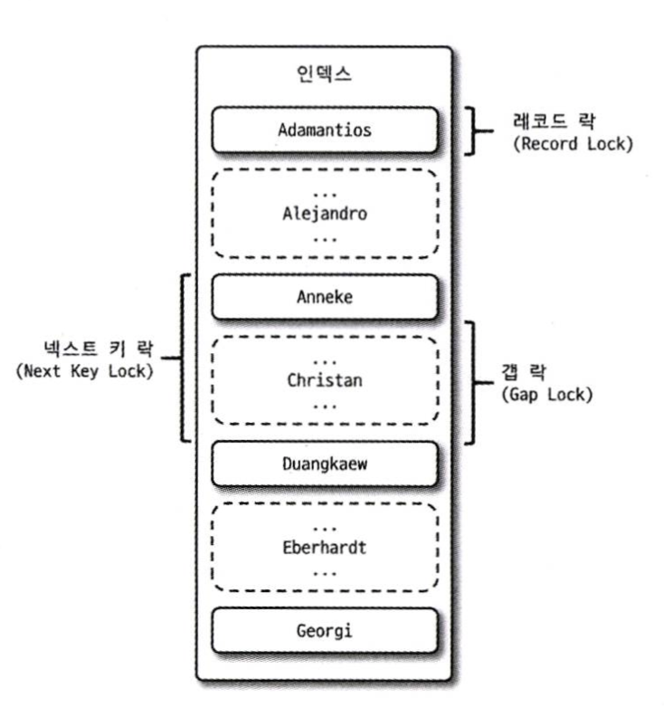

# 5.3 InnoDB 스토리지 엔진 잠금
- InnoDB 스토리지 엔진은 레코드 기반의 잠금 방식을 채택으로 MyISAM에 대비하여 뛰어난 동시성 처리 기능 제공.
- information_schema을 사용하여 트랜잭션과 잠금, 잠금 대기 중인 트랜잭션의 목록을 조회 및 관리.
  - information_schema.INNODB_TRX
  - information_schema.INNODB_LOCKS
  - information_schema.INNODB_LOCK_WAITS
- 다만, MySQL 8버전 이후 Performance Schema를 사용한 방식을 권장. 
  - performance_schema.data_locks
  - performance_schema.data_lock_waits
  
## 5.3.1 InnoDB 스토리지 엔진의 잠금
- InnoDB에서 존재하는 락은 아래 그림과 같다.
  - 레코드락
  - 넥스트 키 락
  - 갭락
  - 자동증가락



- 참고로 InnoDB의 경우 레코드 락이 페이지 락으로 레벨업되는 경우(락 에스컬레이션)은 없다.

### 5.3.1.1 레코드 락
- 레코드 자체를 잠금.
- 다른 DBMS와 다른 점은 레코드 자체가 아닌 인덱스를 통해 레코드를 잠금. 인덱스가 없을 경우 내부적으로 자동 생성된 클러스터 인덱스를 사용.
- 프라이머리키, 유니크 인덱스의 경우 해당 레코드만 잠그며, 나머지 상황은 넥스트 키 락, 갭락을 사용하여 레코드 사이의 간격을 잠근다. 결과적으로 MySQL의 트랜잭션을 관리할 때, 최대한 인덱스를 활용하여 잠그도록 유도해야 한다. 

### 5.3.1.2 갭락
- 다른 DBMS에 없는 락.
- 레코드 자체가 아닌 레코드와 바로 인접한 레코드 사이의 간격만을 잠가서, 새로운 레코드가 생성(insert)되는 것을 제어.
- 아래 t004 예제에 따르면 2부터 4까지 락을 걸었으나 레코드가 존재하는 1부터 6까지 락이 걸림을 확인할 수 있다. 그러므로 6을 초과하는 7부터 다른 트랜잭션이 인서트할 수 있다.

```sql

-- given
create table t004 (
      id int primary key,
      name varchar(1000)
);
insert into t004(id, name) values (1, 'kim'), (6, 'lee');

-- tx1
select * from t004 where id between 2 and 4 for update;

-- tx2, 실패
insert into t004 (id, name) values (3, 'choi');

-- tx2, 실패
insert into t004 (id, name) values (5, 'choi');

-- tx2, 성공
insert into t004 (id, name) values (7, 'choi');
```

### 5.3.1.3 넥스트 키 락
- 레코드 락과 갭 락을 합쳐 놓은 형태의 잠금.
- 갭 락과 넥스트 키 락은 바이너리 로그에 기록되는 쿼리가 레플리카 서버에 실행될 때 소스 서버에 만들어 낸 결과와 동일한 결과를 만들어내도록 보장하는 것이 주 목적이다.
- STATEMENT 포맷의 바이너리 로그를 사용하는 MySQL 서버에서는 REFEATABLE READ로 격리수준을 사용해야 한다. 로그 포맷은 ROW 형태를 권장한다.

> STATEMENT 바이너리 로그? https://omty.tistory.com/63

### 5.3.1.4 자동 증가 락
- MySQL의 자동 증가하는 숫자 값을 추출하기 위해 AUTO_INCREMENT라는 칼럼 속성을 제공하여, 여러 레코드가 동시에 INSERT 되더라도 중복되지 않는 증가하는 숫자를 보장한다. 이를 위하여 내부적으로 AUTO_INCREMENT 락을 사용한다.
- INSERT와 REPLACE 등 새로운 레코드를 저장하는 쿼리에서만 사용된다.
- AUTO_INCREMENT 값을 가져오는 순간만 락이 걸린다.
- 자동 증가 락을 제어하는 방법은 없으며 대부분의 경우 자동 증가 락으로 인한 문제가 발생하지 않는다.
- `innodb_autoinc_lock_mode=0|1|2`
  - 다만 자동 증가 락의 작동 방식은 변경할 수 있다. 각 상황에 따라 자동 증가 락과 그것의 경량 락인 래치(뮤텍스) 중 하나를 선택할 수 있다.
  - 0: 모든 INSERT 문장은 자동 증가 락을 사용한다.
  - 1: 연속모드
    - INSERT되는 레코드의 건수를 정확하게 예측할 수 있을 경우 자동 증가 락이 아닌 래치를 사용하여 성능 효과를 누린다.
    - 다만, INSERT...SELECT의 경우 건수를 예측할 수 없으므로 자동 증가 락을 사용한다. 자동 증가 락을 걸고 여러 개의 값을 미리 할당 받아 연속된 순서를 보장받는다. 미사용한 값은 폐기한다.
  - 2: 인터리빙 모드
    - 언제나 래치를 사용한다.
    - INSERT...SELECT 등 건수를 예측할 수 없는 레코드의 경우 연속된 레코드 간 값이 하나 씩 증가하는 것을 보장하지 않는다. 
    - "STATEMENT 포맷의 바이너리 로그를 사용하는 복제"에서는 소스 서버와 레플리카 서버 간 자동 증가 값이 달라질 수 있으므로 주의.
  - MySQL 8.0의 기본값은 2이며, 바이너리 로그를 사용할 경우 1을 권장.
  
## 5.3.2 인덱스와 잠금
- MySQL은 레코드를 잠그는 것이 아니라 인덱스를 잠금.
- **변경해야 할 레코드를 찾기 위해 검색한 인덱스의 레코드를 전체에 락을 걸어야 한다.** 

```sql
create table t003(
 id int auto_increment primary key,
 name varchar(100) ,
 address varchar(100),
 dt datetime,
 index ix_name(name)
);
    
insert into t003(name, address) values ('lee', 'seoul'), ('kim', 'pusan'), ('kim', 'seoul'), ('lee', 'pusan');

-- tx1
update t003
set dt = now()
where name='kim' and address = 'pusan';

-- tx2
-- 정상
update t003
set dt = now()
where name = 'pusan';

-- 정상
update t003
set dt = now()
where name = 'seoul';

-- 정상
update t003
set dt = now()
where name = 'lee';

-- 락
update t003
set dt = now()
where name = 'kim';
```

- tx1가 udpate를 수행했을 때, where절의 인덱스에 해당하는 레코드(name='kim')가 락이 걸림을 확인할 수 있다. 
- 만약 name 칼럼에도 인덱스가 없었으면 어떻게 되었을까? 그럴 경우 모든 레코드에 락이 걸린다. 그러므로 MySQL은 인덱스 설계는 매우 중요하다. 

## 5.3.3 레코드 수준의 잠금 확인 및 해제
- InnoDB 기준으로 MySQL 엔진과 스토리지 엔진의 락이 서로 다르며, 각 각을 동시에 관리하는 것은 어렵다.
- MySQL의 버전이 올라가며 이를 모니터링할 수 있는 기능이 확장되었다.
- MySQL 8.0 버전 이후, performance_schema를 사용하여 아래와 같이 모니터링한다.

- 아래 예제는 tx1이 레코드에 대해 잠금 후 대기 중이며, tx2와 tx3는 tx1이 해당 레코드의 잠금을 해제할 때까지 대기 중. 

```sql
create table t001 (
  id int primary key,
  name varchar(1000)
);

insert into t001(id, name) values (1, 'kim'), (2, 'lee');

-- tx1
update t001 set name = 'changed' where id = 1;
-- tx2
update t001 set name = 'changed' where id = 1;
-- tx3
update t001 set name = 'changed' where id = 1;
```

```sql
-- 프로세스를 조회한다.
show processlist;

-- 스레드를 중지 시킨다.
kill :threadName;

-- 락과 관련한 상태를 확인한다.
SELECT
    r.trx_id waiting_trx_id,
    r.trx_mysql_thread_id waiting_thread,
    r.trx_query waiting_query,
    b.trx_id blocking_trx_id,
    b.trx_mysql_thread_id blocking_thread,
    b.trx_query blocking_query
FROM performance_schema.data_lock_waits w
INNER JOIN information_schema.innodb_trx b
  ON b.trx_id = w.BLOCKING_ENGINE_TRANSACTION_ID
INNER JOIN information_schema.innodb_trx r
  ON r.trx_id = w.REQUESTING_ENGINE_TRANSACTION_ID;

select * from performance_schema.data_locks;
```
